# Ciclo completo: diagrama de estados

De la descripción del problema, sus casos de prueba y una representación a un solver afinado
(`llm/cycle.py`). Aristas continuas: transición fija; punteadas: condicionales (resultado del
validador). Cada nodo `valida_*` es determinista (sin LLM); los nodos de generación llaman al LLM
y reciben, al ser rechazados, el reporte del validador como feedback.

```mermaid
%%{init: {'flowchart': {'curve': 'linear'}}}%%
graph TD;
	__start__([<p>__start__<br/>descripción + casos + representación</p>]):::first

	subgraph modelo["model — ProblemModel por piezas (llm.parts_generator)"]
		vista_heuristica(vista_heuristica)
		valida_heuristica(valida_heuristica<br/>casos visibles y ocultos)
		vista_mip(vista_mip)
		valida_mip(valida_mip<br/>punto a punto + óptimo esperado)
		vista_constructiva(vista_constructiva)
		valida_constructiva(valida_constructiva<br/>construcciones al azar factibles)
	end

	subgraph componentes["components — desde cero sobre el modelo (llm.cli)"]
		planifica_slots(planifica_slots)
		genera_componente(genera_componente<br/>greedy_score · neighborhood · perturbation · destruction)
		valida_componente(valida_componente<br/>sintáctica · contractual · calidad · diversidad · combinación)
	end

	subgraph optimiza["optimize — mismas salidas, más rápido (llm.optimizer)"]
		acelera_modelo(acelera_modelo)
		equivalencia_modelo(equivalencia_modelo<br/>salidas idénticas + ≥1,5×)
		acelera_componente(acelera_componente)
		equivalencia_componente(equivalencia_componente<br/>salidas idénticas + COMPONENT igual + ≥1,5×)
	end

	subgraph tune["tune — réplicas en paralelo (tuning.cli)"]
		replicas(replicas<br/>semillas del tuner)
		sondeo(sondeo<br/>defaults + variantes de un componente)
		tpe(tpe<br/>Optuna)
		reevaluacion(reevaluacion<br/>elecciones distintas + gemelos por defecto)
		test(test<br/>mismas instancias, IC95)
		agrega(agrega<br/>mejor conocido común entre réplicas)
	end

	__end__([<p>__end__<br/>solver afinado</p>]):::last
	falla([<p>falla<br/>modelo rechazado</p>]):::last

	__start__ --> vista_heuristica;
	vista_heuristica --> valida_heuristica;
	valida_heuristica -. &nbsp;rechazada: reporte&nbsp; .-> vista_heuristica;
	valida_heuristica -. &nbsp;aceptada&nbsp; .-> vista_mip;
	valida_heuristica -. &nbsp;rondas agotadas&nbsp; .-> falla;
	vista_mip --> valida_mip;
	valida_mip -. &nbsp;rechazada: familia, restricción, punto&nbsp; .-> vista_mip;
	valida_mip -. &nbsp;aceptada&nbsp; .-> vista_constructiva;
	valida_mip -. &nbsp;rondas agotadas&nbsp; .-> falla;
	vista_constructiva --> valida_constructiva;
	valida_constructiva -. &nbsp;rechazada&nbsp; .-> vista_constructiva;
	valida_constructiva -. &nbsp;aceptada: slot greedy_score&nbsp; .-> planifica_slots;
	valida_constructiva -. &nbsp;rondas agotadas: slot constructor&nbsp; .-> planifica_slots;

	planifica_slots --> genera_componente;
	genera_componente --> valida_componente;
	valida_componente -. &nbsp;rechazado: reporte&nbsp; .-> genera_componente;
	valida_componente -. &nbsp;quedan variantes o slots&nbsp; .-> planifica_slots;
	valida_componente -. &nbsp;catálogo listo&nbsp; .-> acelera_modelo;
	valida_componente -. &nbsp;sin optimizar&nbsp; .-> replicas;

	acelera_modelo --> equivalencia_modelo;
	equivalencia_modelo -. &nbsp;rechazado&nbsp; .-> acelera_modelo;
	equivalencia_modelo -. &nbsp;aceptado o rondas agotadas&nbsp; .-> acelera_componente;
	acelera_componente --> equivalencia_componente;
	equivalencia_componente -. &nbsp;rechazado&nbsp; .-> acelera_componente;
	equivalencia_componente -. &nbsp;quedan componentes&nbsp; .-> acelera_componente;
	equivalencia_componente -. &nbsp;listo&nbsp; .-> replicas;

	replicas --> sondeo;
	sondeo --> tpe;
	tpe -. &nbsp;quedan trials&nbsp; .-> tpe;
	tpe -. &nbsp;trials agotados&nbsp; .-> reevaluacion;
	reevaluacion --> test;
	test --> agrega;
	agrega --> __end__;

	classDef default fill:#f2f0ff,line-height:1.2
	classDef first fill-opacity:0
	classDef last fill:#bfb6fc
```

